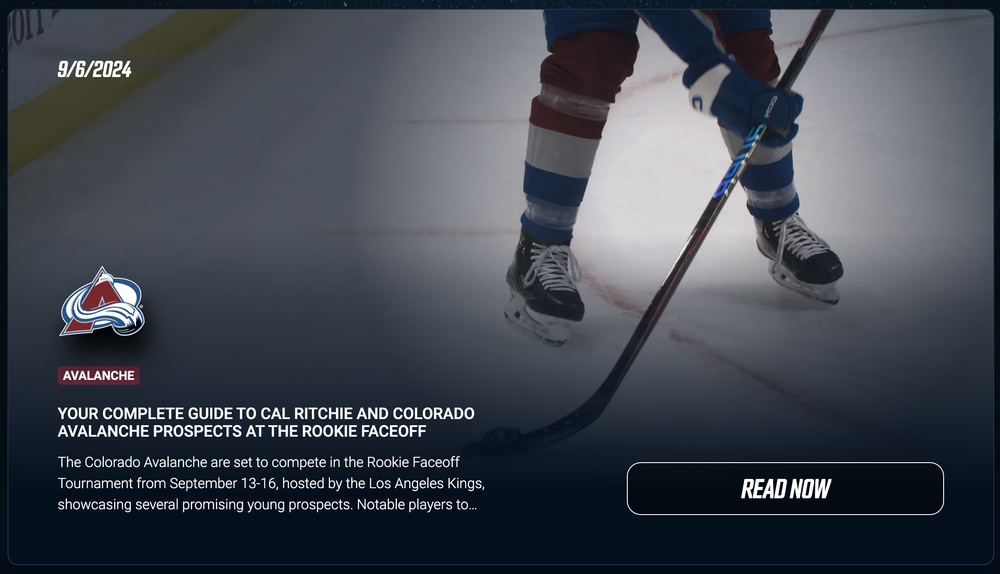
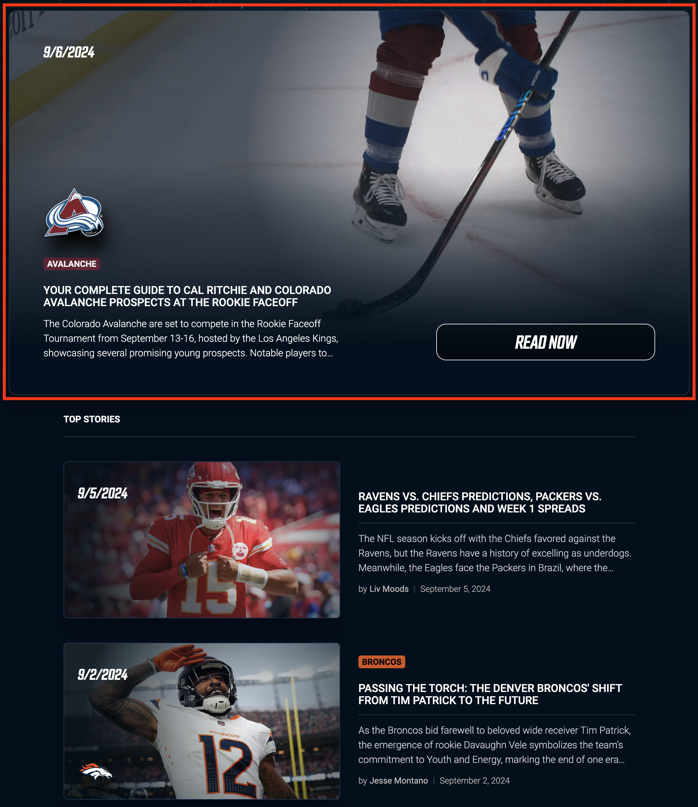
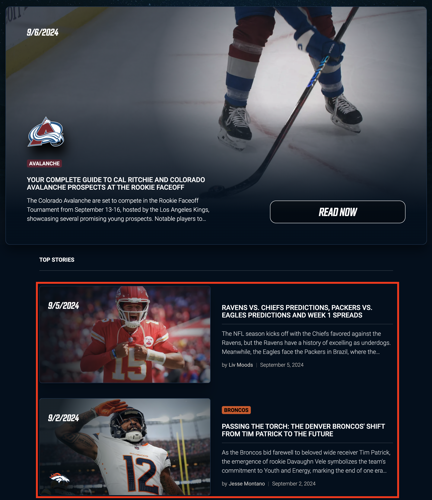
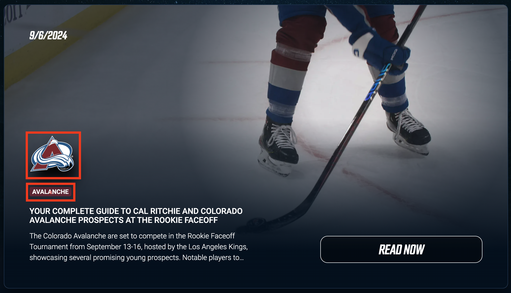

# Articles

Articles, like [Stories](../stories/stories.md), can have a story-type, however,
unlike stories, are text based and **do not** rely on a video.

**Note:** The body of an article should contain
typographic, photographic, or other graphic elements
to help the reader keep attention and follow through the article.

Articles contain the following content:
[Referenced Article](https://www.guerillasports.net/articles/your-complete-guide-to-cal-ritchie-and-colorado-avalanche-prospects-at-the-rookie-faceoff)

- Name: A descriptive name for the article
  - Your Complete Guide To Cal Ritchie And Colorado Avalanche Prospects At The Rookie Faceoff
- Date: publication date
  - 09/06/2924
- Description: a hook for your audience
and an SEO description for the article.
- Author: the author of the article
For adding a new author see [Authors]()
  - Meghan Angley
- Image: The main article thumbnail.
Only required to feature the article.

- Feature: a switch to optionally feature the article.
 **Note:** Featured articles show up as follows:
  - Most recently featured article
  
  - 2 most-recently featured articles older than the most-recent.
  
- Body: rich text field for article content.
**Note:** The author should first write the article in a text-editor
like MS Word or Pages, format the article with decent
typographic hierarchy and images in the body before pasting
the article into this field. Articles should be well-designed to keep the reader engaged.
  - see the [article](https://www.guerillasports.net/articles/your-complete-guide-to-cal-ritchie-and-colorado-avalanche-prospects-at-the-rookie-faceoff) for the content.
- Home Team: if the article references a home team, select it here.
For adding a new home team, see [Home Teams]().
  - Colorado Avalanche
  
- Opponent: If the article references a specific game, select the opponent.
For adding a new opponent team, see [Opponent Teams]()
- Story Type: If the article conforms to an existing story-type
select it here. See [Story Types](../stories/stories.md) for more information.
- Story Title: Unfinished feature?
If the article does not conform to an existing story-type
create a one-off name here.
See [Story Types](../stories/stories.md) for more information.
- Pre-game or Post-game: Leave blank if neither apply.
- Name if exclusive interview:
If the story-type is "exclusive interview"
put the name of the interviewee here.
- Score home & Score away: if post-game, and it is relevant,
place the game scores here.
