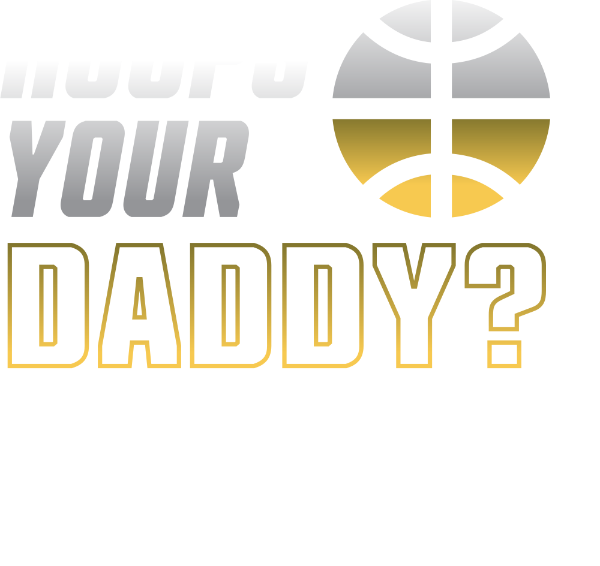
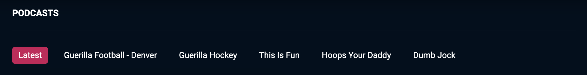
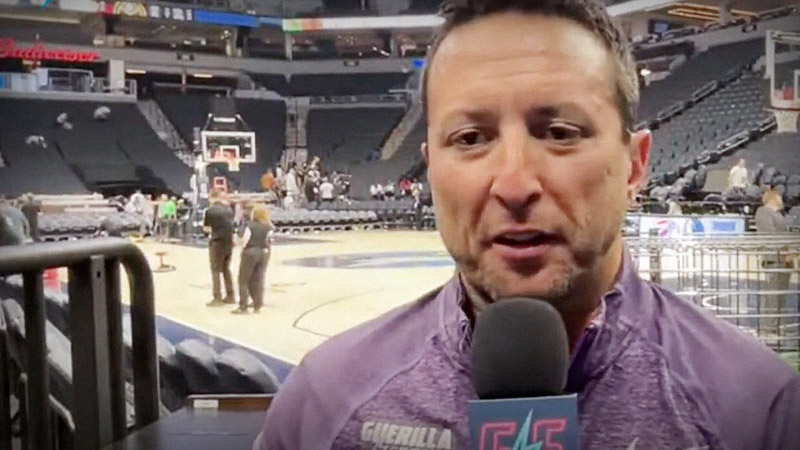

# Podcasts and Podcast Episodes

## Podcasts

A podcast is a collection of episodes surrounding a theme or topic.
For example, the Guerilla Sports' podcast *Hoops Your Daddy*
follows Liv Moods and her spicy takes thorough
her opinions on all things NBA and Denver Nuggets.

A podcast consists of five main components. Using *Hoops Your Daddy* as an example:

1. Name:
    - *Hoops Your Daddy*
2. Logo: a square SVG logo which identifies the podcast
   
3. Title: Likely the same as the Name
    - *Hoops Your Daddy*
4. Description: A hook to entise and excite an audience
    - Liv Moods, and her classic spicy takes,
    gives her opinion on all things NBA and Denver Nuggets.
5. Metadata: a collection of information like sort-order and discoverable links
    - Spotify Link
    - Apple Link
    - Sort/Filter Order
    - Show On website: a switch which enables the
    podcast to show up as a filter on the Podcasts landing page:
 

// NOTE: Should move this to it's own section. The above content explains well enough how one should add a podcast.

### <h3 id="creating-a-podcast">Creating a new podcast</h3>

To add a new podcast, navigate to the [Guerilla Sports site](www.guerillasports.net?edit) and login as a content editor.
(for help with logging in as a content editor, see [Editing Site Content]()).

- Click the icon in the bottom-left corder to show collections.
- You should see a tab named "GS Podcasts"
- Click "New".
- Enter the above information and save.
- Optionally publish the new podcast if ready.

## Podcast Episodes

Episodes are related to a **Podcast** as a child.
Episodes consist of the following content:

- Episode Name: Can be the unique title of the episode
or reference the name of the podcast followed by the episode number.
Episode naming should be consistent with other episodes,
but can differ between podcasts.
  - *Hoops Your Daddy 008*
- Date: release/publish date of the episode
  - 05/12/2024
- Podcast: the parent podcast. The podcast must first be created. See [Creating A Podcast](#creating-a-podcast).
  - *Hoops Your Daddy*
- Episode number: in the format `001`, enter the episode number
  - 008
- Description: A brief description of the episode.
This should aim to hook the audience, and serve as the
SEO description for the episode.
  - GAME 4 DEN @ MIN.
  Liv Moods is LIVE from the Guerilla Sports Studios to
  breakdown Game 4 of the Round 2 Series between the
  Denver Nuggets and the Minnesota Timberwolves.
- Supporting Content: a rich-text body for additional content
- Thumbnail Image: a supporting image to hook the audience.
This image should feature the subject of the image **on the right-side**.
Otherwise, the subject of the image may be covered by the podcast logo.
  
- Author: Likely the main talent in the podcast.
For adding a new Author, see [Authors]()
  - Liv Moods
- Team-Ref: the team associated with the episode.
This allows the team logo to appear on the thumbnail.
For adding a new home team, see [Home Teams]()
  - Denver Nuggets
