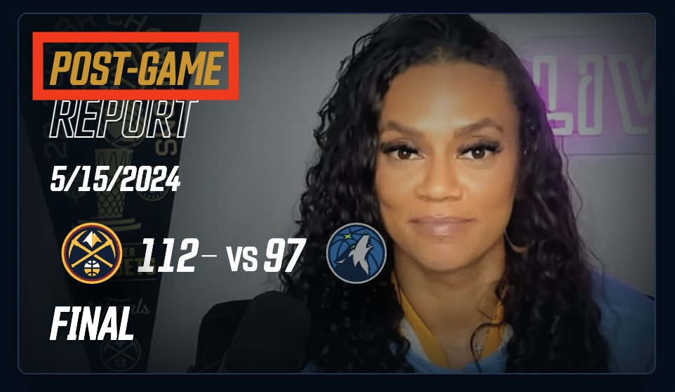
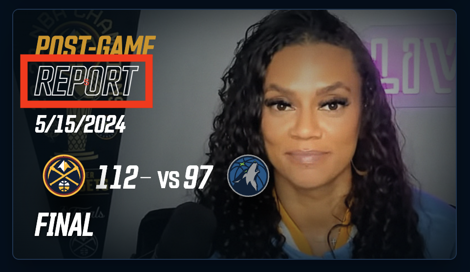
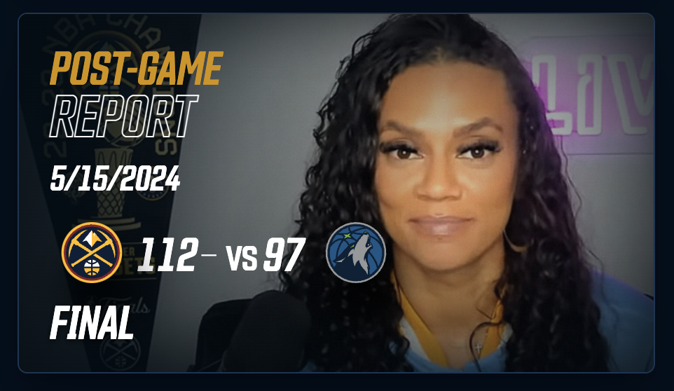
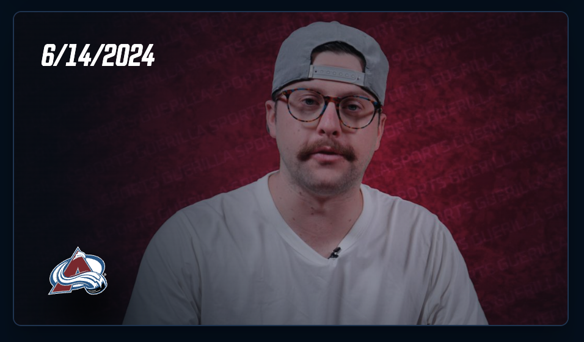
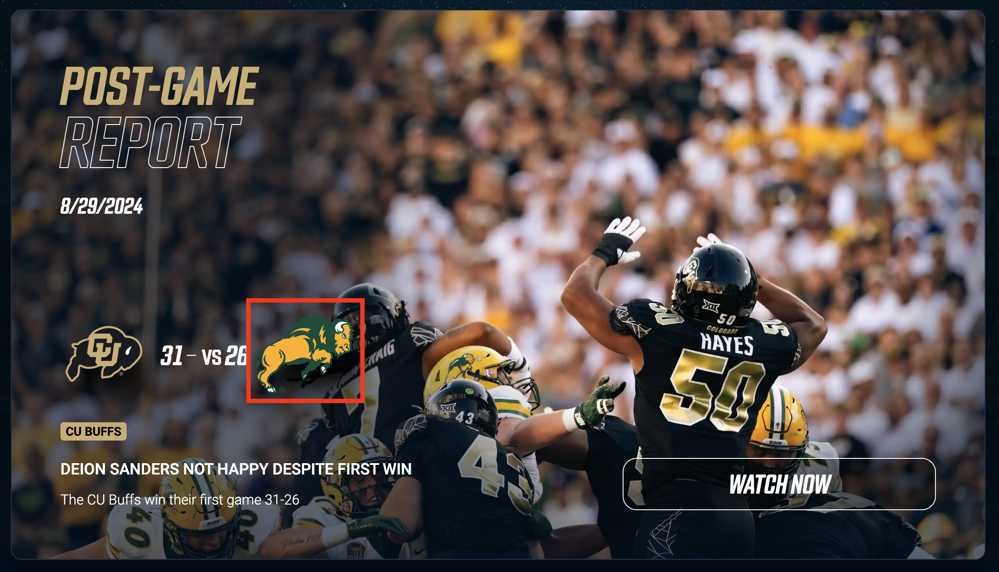
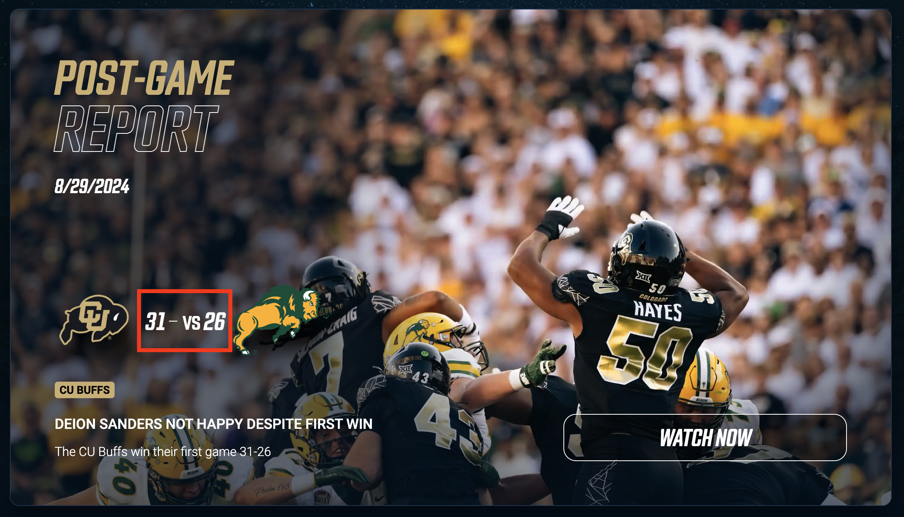
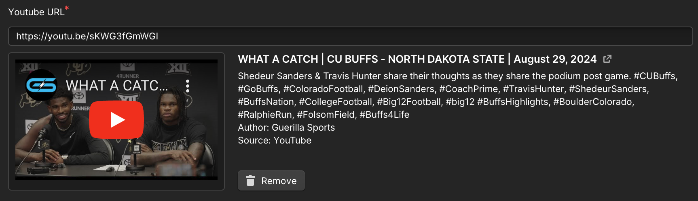

# Stories and Story Episodes

## Story Types

Stories are a way to organize content into different categories.
Examples of different story types are:

- Post-game Report
- Practice Report
- Coach's Presser

Stories can be global, meaning they apply
to many different sports (i.e. Post-Game Report),
or they can be relative to a specific sport (i.e. Morning Skate).

Story Types consist of the following content:

- Name: the name of the story type.
The name should be broken into **two** parts for the next two components.
  - *Post-game Report*
  - Blue Text: Not always blue-text, however
this designates the top text colored by the
team color, or blue if no team is provided. (Note, that
for a Post-game report, a team should always be provided as
not to confuse the audience.)
    - Post-game
    
  - Outlined text: The 2nd half of the story type name.
    - Report
    
- Grouping: This may change in the future,
but should this type be grouped with other story-types
rather than with other stories of this type, provide
a grouping here
  - Game Report
    - This will allow you to group post-game and pre-game reports
    together, rather than grouping
    pre-game and post-game reports exclusivly.

## Story Episodes

These are simply stories which *optionally* employ a story-type.
**Stories are centered around a main video.**
Each story required a specific youtube video to be referenced.
Stories do not need a specific story-type, however,
story types provide stories with filtration, rich-thumnbnail images, and metadata.

### Stories with and without story-types

| With a **Story-Type** | Without a **Story-Type** |
| -------------- | --------------- |
| |  |

---
Stories consist of the following content:
[Referenced Story](https://www.guerillasports.net/episodes-stories/deion-sanders-not-happy-despite-first-win)

- Name: A descriptive name of the content covered in the story.
  - Deion Sanders not happy despite first win
- Home Team: references a home team hydrate the story
with data about that team, their logo, and league.
For adding a home team see [Home Teams](). Choosing a Team
leverages the team logo, main color, and more providing a
rich user-experience.
  - Colorado Buffaloes
    
- Opponent: if the story covers a specific game, choose the opponent.
For adding an opposing team, see [Opposing Teams]().
  - North Dakota State
    
- Date: publishing date
  - 08/29/2024
- Story Type: references a story type
  - Post-game Report
    
- Story Title: Unfinished feature?
Should allow you to do a one-off story-type
without having to create a new one.
- Pre-game or Post-game: if a score is provide,
it will show if "post-game" is selected. Select "NA" if the story
is neither pre or post game.
  - Post-game
    
- Feature: toggle if the story should be featured at the top of the
landing page.
- Name if exclusive-interview: should it be exclusive, and of the
exclusive-interview story type, add the interviewee's name.
- Author: the author / curator of the story.
To add a new author see [Authors]()
  - Jay Boersma
- Score Home & Score Away: away referrs to the opponent.
  - Score Home: 31
  - Score Away: 26
    

- Youtube URL: the youtube video the story is centered around
  - <https://youtu.be/sKWG3fGmWGI>
    
- Blurhash: please ignore this field. I'm working on something :)
